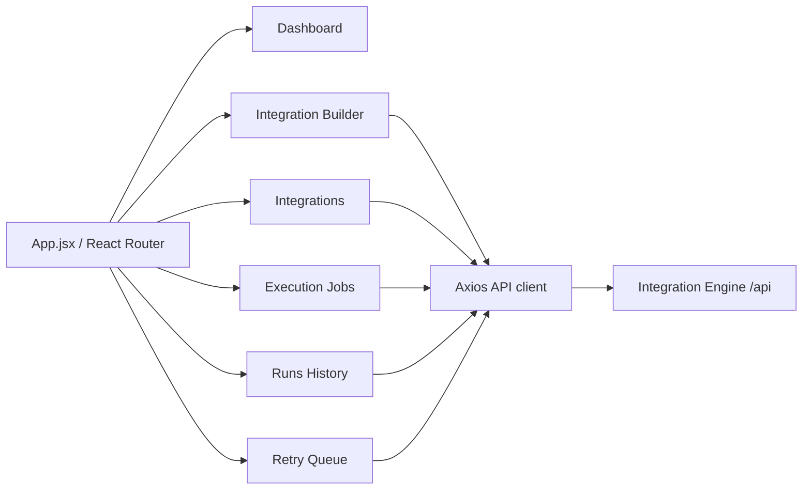
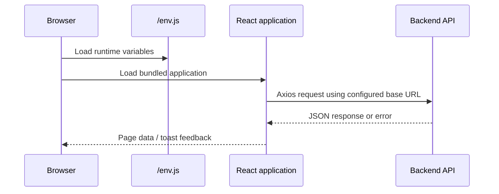

# Frontend architecture

## Pages

`Layout` provides the shared navigation. The pages are routed beneath `/`; new and edit builder routes are `/integrations/new` and `/integrations/:id/edit`.

## API connection

The Axios client reads `appRuntimeConfig.apiBaseUrl` and `appRuntimeConfig.apiTimeoutMs`. Runtime configuration is loaded from `public/env.js`, which allows the same compiled frontend image to point to different backend environments at deployment time.

The backend must permit the UI origin through `APP_CORS_ALLOWED_ORIGINS`.
