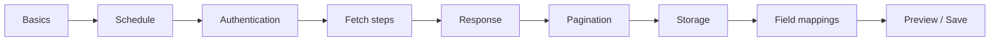

# Integration builder

## Builder workflow

The builder keeps a single `builderState`. When an integration is loaded, it normalizes saved configuration into UI state. On save, it flattens the nested UI `config` objects into the backend DTO shape.

This is important for authentication and storage: the backend expects `type` and its fields at the same configuration level, while the UI uses a nested `config` object for editing.

## Fetch steps and dates

Each fetch step can specify URL, method, headers, query parameters, body, request/response formats, and a request window mode. Date placeholders are sent to the backend as placeholders—not pre-rendered values—so the backend can generate values per scheduled run.

Use formatting fields when a client API requires a non-standard date representation:

| Location | Example | Why |
| --- | --- | --- |
| Query parameter | `${windowStartDate}` with `yyyyMMdd` | Client expects dates in the query string. |
| Header | `X-From-Date: ${windowStartDate}` | Client reads the date from a header. |
| Body | `{ "from": "${windowStartDate}" }` | Client accepts date range JSON/XML body fields. |

The same placeholders can be used in URLs, headers, query parameters, and body templates.

## Storage choices

| Choice | Frontend purpose |
| --- | --- |
| Local / S3 / FTP / FTPS / SFTP | Enter the appropriate destination configuration. |
| HTTP API Upload | Upload generated CSV as multipart data to a third-party URL; configure headers, form fields, file field, and optional upload authentication. |
| Default Tenant Upload | Enter a tenant ID only; backend resolves the URL/token/register settings from the protected tenant database. |

Choose **FTPS (Implicit TLS)** for an FTP server configured in WinSCP as “TLS/SSL Implicit encryption.” It is not the same as SFTP.

For HTTP API uploads, **Upload Authentication** is separate from the integration’s fetch authentication. Use it only if the receiving upload endpoint must obtain its own token.
